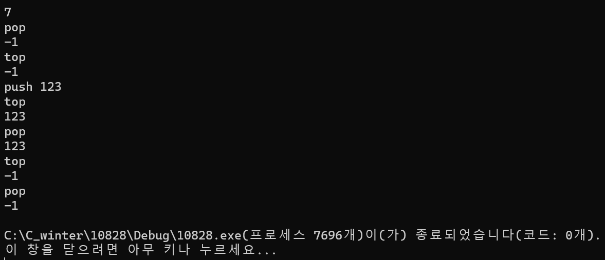

### 2024.02.21
### baekjoon 10828
# **Stack**

## 1. code
 ```c
#define _CRT_SECURE_NO_WARNINGS
#include <stdio.h>
#include <stdlib.h>
#include <string.h>

typedef struct {
	int max;
	int ptr;
	int* stk;
}IntStack;

IntStack s;

int Initialize(IntStack *s, int max) {
	s->ptr = 0;
	if ((s->stk = calloc(max, sizeof(int))) == NULL) {
		s->max = 0;
		return -1;
	}
	s->max = max;
	return 0;
}

int push(IntStack *s, int num) {
	if (s->ptr >= s->max) {
		return 1;
	}
	s->stk[s->ptr++] = num;
	return 0;

}

void pop(IntStack*s) {
	if (s->ptr <= 0) {
		printf("%d\n", -1);
	}
	else {
		printf("%d\n", s->stk[--s->ptr]);
	}
}

void size(IntStack* s) {
	printf("%d\n", s->ptr);
}

void empty(IntStack* s) {
	if (s->ptr <= 0) {
		printf("%d\n", 1);
	}
	else printf("%d\n", 0);
}

void top(IntStack* s) {
	if (s->ptr <= 0) {
		printf("%d\n", -1);
	}
	else {
		printf("%d\n", s->stk[s->ptr - 1]);
	}
}

int main() {
	Initialize(&s, 10000);
	int num, input;
	char function[10];
	scanf("%d", &num);

	while(num--) {
		scanf("%s", function);
		if (!strcmp(function, "push")) {
			scanf("%d", &input);
			push(&s, input);
		}
		else if (!strcmp(function, "pop")) {
			pop(&s);
		}
		else if (!strcmp(function, "empty")) {
			empty(&s);
		}
		else if (!strcmp(function, "size")) {
			size(&s);
		}
		else if (!strcmp(function, "top")) {
			top(&s);
		}
	}
	return 0;
}
 ```
***

## 2. output

***

## 3. Analysis
### How to approach
It's the same problem, but you can also write code through stack.   
In the book, the parameters of the pop function are stack and variables to be removed. However, in this code, the parameter is only stack and the removed variable is immediately printed.

### Pros and Cons
*more complex than array type*
