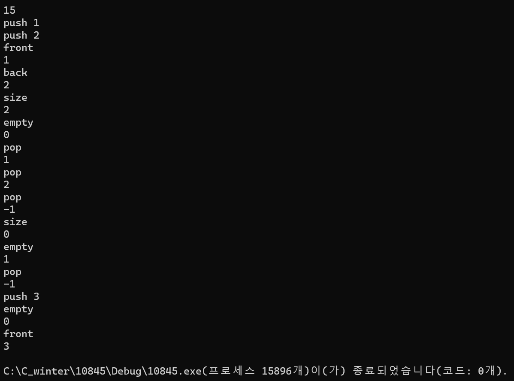

### 2024.02.21
### baekjoon 10845
# **Queue**

## 1. code
 ```c
#define _CRT_SECURE_NO_WARNINGS
#include <stdio.h>
#include <string.h>

int queue[10000];
int cnt = 0;

void push(int num) {
	queue[cnt] = num;
	cnt++;
}

void pop() {
	if (cnt == 0) {
		printf("%d\n", -1);
	}
	else {
		cnt--;
		printf("%d\n", queue[0]);
	}
}

void size() {
	printf("%d\n", cnt);
}

void empty() {
	if (cnt == 0) {
		printf("%d\n", 1);
	}
	else {
		printf("%d\n", 0);
	}
}

void front() {
	if (cnt == 0) {
		printf("%d\n", -1);
	}
	else {
		printf("%d\n", queue[0]);
	}
}

void back() {
	if (cnt == 0) {
		printf("%d\n", -1);
	}
	else {
		printf("%d\n", queue[cnt-1]);
	}
}

void setting() {
	for (int i = 0; i < cnt; i++) {
		queue[i] = queue[i + 1];
	}
}

int main() {
	int num, input;
	char function[10];

	scanf("%d", &num);

	for (int i = 0; i < num; i++) {
		scanf("%s", &function);
		if (!strcmp(function, "push")) {
			scanf("%d", &input);
			push(input);
		}
		else if (!strcmp(function, "pop")) {
			pop();
			setting();
		}
		else if (!strcmp(function, "size")) {
			size();
		}
		else if (!strcmp(function, "empty")) {
			empty();
		}
		else if (!strcmp(function, "front")) {
			front();
		}
		else if (!strcmp(function, "back")) {
			back();
		}
	}
	return 0;
}
 ```
***

## 2. output

***

## 3. Analysis
### How to approach
The queue was implemented using array.    
Unlike the stack, the queue is a first-in-first-out method, so it is necessary to rearrange it after output the first value. If the elements are advanced one by one, the 0th value disappears and the remaining values are stored.   
In addition, strcmp was used to designate different functions to execute according to the value input by the user.

### Pros and Cons
It can be accessed through an array without implementing a structure.   
*more simple than struct type*
