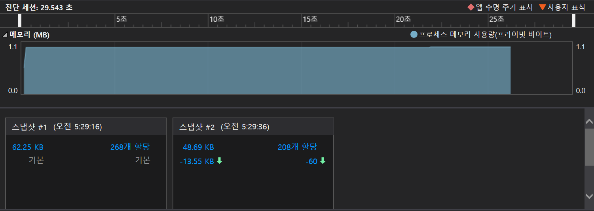
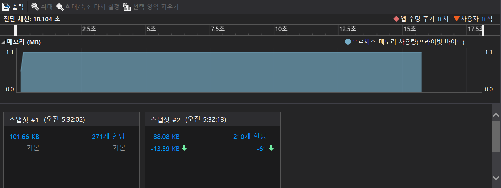

### 2024.02.21
### baekjoon 10845
# **Queue**

## 1. code
### using array
 ```c
#define _CRT_SECURE_NO_WARNINGS
#include <stdio.h>
#include <string.h>

int queue[10000];
int cnt = 0;

void push(int num) {
	queue[cnt] = num;
	cnt++;
}

void pop() {
	if (cnt == 0) {
		printf("%d\n", -1);
	}
	else {
		cnt--;
		printf("%d\n", queue[0]);
	}
}

void size() {
	printf("%d\n", cnt);
}

void empty() {
	if (cnt == 0) {
		printf("%d\n", 1);
	}
	else {
		printf("%d\n", 0);
	}
}

void front() {
	if (cnt == 0) {
		printf("%d\n", -1);
	}
	else {
		printf("%d\n", queue[0]);
	}
}

void back() {
	if (cnt == 0) {
		printf("%d\n", -1);
	}
	else {
		printf("%d\n", queue[cnt-1]);
	}
}

void setting() {
	for (int i = 0; i < cnt; i++) {
		queue[i] = queue[i + 1];
	}
}

int main() {
	int num, input;
	char function[10];

	scanf("%d", &num);

	for (int i = 0; i < num; i++) {
		scanf("%s", &function);
		if (!strcmp(function, "push")) {
			scanf("%d", &input);
			push(input);
		}
		else if (!strcmp(function, "pop")) {
			pop();
			setting();
		}
		else if (!strcmp(function, "size")) {
			size();
		}
		else if (!strcmp(function, "empty")) {
			empty();
		}
		else if (!strcmp(function, "front")) {
			front();
		}
		else if (!strcmp(function, "back")) {
			back();
		}
	}
	return 0;
}
```

***
### using queue
```c
#define _CRT_SECURE_NO_WARNINGS
#include <stdio.h>
#include <stdlib.h>
#include <string.h>

typedef struct {
	int max;
	int num;
	int front;
	int rear;
	int* que;
}IntQueue;

int Initialize(IntQueue *q, int max) {
	q->num = q->front = q->rear = 0;
	if ((q->que = calloc(max, sizeof(int))) == NULL) {
		return;
	}
	q->max = max;
	return 0;
}

void push(IntQueue* q, int input) {
	q->num++;
	q->que[q->rear++] = input;
	if (q->rear == q->max) {
		q->rear = 0;
	}
}

void pop(IntQueue* q) {
	int x;
	if (q->num <= 0) {
		printf("%d\n", -1);
	}
	else {
		q->num--;
		if (q->front == q->max) {
			q->front = 0;
		}
		x = q->que[q->front++];
		printf("%d\n", x);
	}
}

void size(IntQueue *q) {
	printf("%d\n", q->num);
}

void empty(IntQueue* q) {
	if (q->num <= 0) {
		printf("%d\n", 1);
	}
	else {
		printf("%d\n", 0);
	}
}

void front(IntQueue* q) {
	if (q->num <= 0) {
		printf("%d\n", -1);
	}
	else {
		printf("%d\n", q->que[q->front]);
	}
}

void back(IntQueue* q) {
	if (q->num <= 0) {
		printf("%d\n", -1);
	}
	else {
		printf("%d\n", q->que[q->rear-1]);
	}
}


int main() {
	IntQueue q;
	Initialize(&q, 10000);

	int num, input;
	char order[10];
	scanf("%d", &num);

	while (num--) {
		scanf("%s", &order);
		if (!strcmp(order, "push")) {
			scanf("%d", &input);
			push(&q, input);
		}
		else if (!strcmp(order, "pop")) {
			pop(&q);
		}
		else if (!strcmp(order,"size")) {
			size(&q);
		}
		else if (!strcmp(order, "empty")) {
			empty(&q);
		}
		else if (!strcmp(order, "front")) {
			front(&q);
		}
		else if (!strcmp(order, "back")) {
			back(&q);
		}
	}

	return 0;
}
 ```
***

## 2. output

***

## 3. Analysis
### How to approach    
The code using array only use cnt, unlike the code using queue. If so, cnt can play both the role of front and rear.    
Add the values to the one-dimensional array in the order in which they are entered. The pop fuction outputs the preceding element. Unlike the stack, the queue is a first-in-first-out method, so it is necessary to rearrange it after output the first value. The setting function advances the remaining elements by one.

I implemented the code using the queue just because we learned the queue.

strcmp is used to designate different functions to execute according to the value input by the user. In fact, as a switch-case statement, I wanted to specify a function to execute according to the value entered by the user. However, I used the else if statement because an error occurs when I receive a string in the case.


### Pros and Cons
memory for code using array

***
memory for code using queue


*using array is about two times more simple than using queue.*
