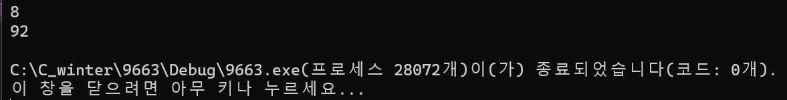

### 2024.02.23
### baekjoon 9663
# **N-Queen**

## 1. code
 ```c
#define _CRT_SECURE_NO_WARNINGS
#include <stdio.h>
#include <stdlib.h>

int cnt = 0;

void set(int* a, int* b, int* c, int* pos, int n, int i) {
	for (int j = 0; j < n; j++) {
		if (!a[j] && !b[i + j] && !c[i - j + n - 1]) {
			pos[i] = j;
			if (i == n - 1) {
				cnt++;
				return;
			}
			else {
				a[j] = b[i + j] = c[i - j + n - 1] = 1;
				set(a, b, c, pos, n, i + 1);
				a[j] = b[i + j] = c[i - j + n - 1] = 0;
			}
		}
	}

	return;
}

int main() {
	int n;
	scanf("%d", &n);

	int* a =  calloc(n, sizeof(int));
	int* b = calloc(2*n-1, sizeof(int));
	int* c = calloc(2 * n - 1, sizeof(int));
	int* pos = calloc(n, sizeof(int));


	for (int i = 0; i < n; i++) {
		a[i] = 0;
	}
	for (int i = 0; i < 2*n-1; i++) {
		b[i] = 0;
		c[i] = 0;
	}

	set(a, b, c, pos, n, 0);
	printf("%d\n", cnt);

	free(a);
	free(b);
	free(c);
	free(pos);

	return 0;
}
 ```
***

## 2. output

***

## 3. Analysis
### How to approach
n<=3 -> **no solution**   
n must be larger than 3. at least 4.   
However, there is no need to limit this condition through conditional statements. Because the scorer puts only the integers within the range and executes the code.   

There are only one queen in each rowas and colums.  
Because of this rule, we get three arrays. => a[n], b[2*n-1], c[2*n-1]
And we need one more array that shows where queen is in each colums. pos[n]

In main function, we initialize all elements in a, b, c tp 0. and set(0) 
Here, 0 means a place where a queen can be put, and 1 means that it cannot be put.

In set function, we execute the recursive function on the condition that we can place only one queen per row and one queen per diagonal.    
If i becomes n-1, we increase cnt by 1, since we have assigned queens to all columns.

### Pros and Cons
...
