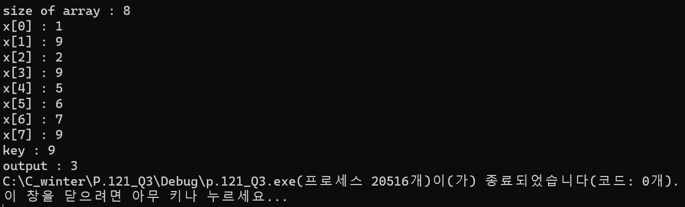

### 2024.02.16
### 자료구조와 함께 배우는 알고리즘 입문 p.121_Q3
# **Find the number of key**

## 1. code
 ```c
#define _CRT_SECURE_NO_WARNINGS
#include <stdio.h>
#include <stdlib.h>

int serach_idx(const int a[], int n, int key, int idx[]) {
	int j = 0;
	for (int i = 0; i < n; i++) {
		if (a[i] == key) {
			idx[j++] = a[i];
		}
	}
	return j;
}

int main() {
	int n, key;
	printf("size of array : ");
	scanf("%d", &n);
	int *a = calloc(n, sizeof(int));
	int* idx = calloc(n, sizeof(int));

	if (a == NULL) {
		printf("fail to allocate memory\n");
		return 1;
	}

	for (int i = 0; i < n; i++) {

		printf("x[%d] : ", i);
		scanf("%d", &a[i]);
	}

	printf("key : ");
	scanf("%d", &key);

	int num_of_key = serach_idx(a, n, key, idx);	
	printf("output : %d", num_of_key);
	return 0;
}
 ```
***

## 2. output

***

## 3. Analysis
### How to approach
In an array a in which the number of elements is n, the indexes of all elements matching the key are stored in order from the beginning of the array idx, and the number of matched elements is returned.

### Pros and Cons
When overlapping elements exist, all indexes in which elements matching the key exist may be found.   
*However, it has high complexity compared to binary search.*
