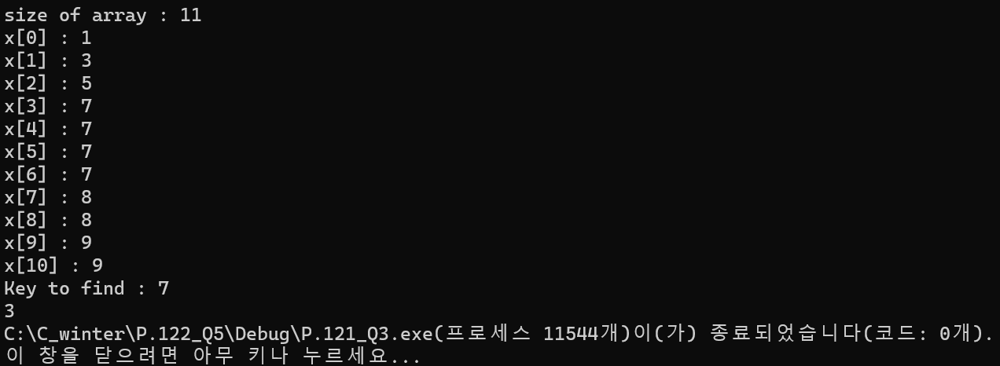

### 2024.02.16
### 자료구조와 함께 배우는 알고리즘 입문 p.122_Q5
# **Title**

## 1. code
 ```c
#define _CRT_SECURE_NO_WARNINGS
#include <stdio.h>
#include <stdlib.h>

int compare(const void* a, const void* b) {
	if (*(int*)a < *(int*)b) {
		return -1;
	}
	else if (*(int*)a > *(int*)b) {
		return 1;
	}
	else return 0;
}

int search_idx(const int a[], int n, int key) {
	int *q = bsearch(&key, a, n, sizeof(int), compare);
	int idx = (int) (q - a);
	int cnt = 0;
	for (int i = 1; i < n; i++) {
		if (a[idx-1] == a[idx]) {
			idx--;		}
	}
	return idx;
}

int main() {
	int n, key;
	printf("size of array : ");
	scanf("%d", &n);
	int* x = calloc(n, sizeof(int));
	if (x == NULL) {
		puts("fail to allocate memory");
	}

	printf("x[%d] : ", 0);
	scanf("%d", &x[0]);
	for (int i = 1; i < n; i++) {
		while (x[i] > x[i - 1]); {
			printf("x[%d] : ", i);
			scanf("%d", &x[i]);
		}
	}

	printf("Key to find : ");
	scanf("%d", &key);

	int first = search_idx(x, n, key);
	printf("%d", first);

	return 0;
}
 ```
***

## 2. output

***

## 3. Analysis
### How to approach
Binary search has two characteristics.   
The array of search targets should always be aligned.Also, if you have multiple elements, such as the value you search for, you don't always find the element at the front.   
However, in this problem, if the value of the index found using binary search is the same as the value immediately preceding it, idx is reduced by 1. Repeating this until it is different from the previous value returns the result.

### Pros and Cons
We can overcome the shortcomings of binary as a function to find the element in front of us.   
*However, through repetitions, the time complexity became O(n).*
