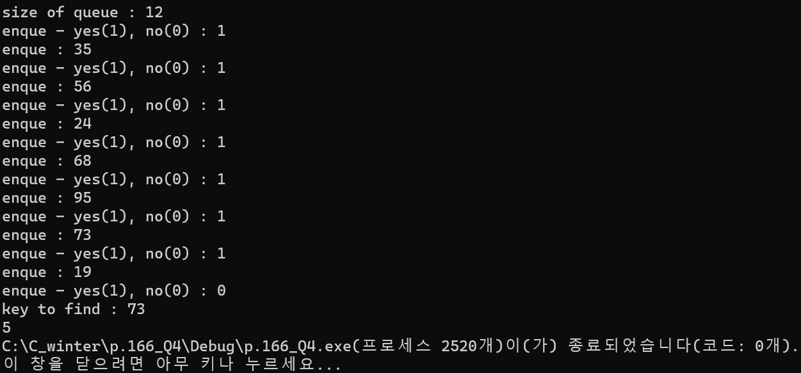

### 2024.02.16
### 자료구조와 함께 배우는 알고리즘 입문 p.166_Q4
# **Find the realative location of the key**

## 1. code
 ```c
#define _CRT_SECURE_NO_WARNINGSs
#include <stdio.h>
#include <stdlib.h>

typedef struct {
	int max;
	int num;
	int front;
	int rear;
	int* que;
}IntQueue;

/*--- 큐 초기화 ---*/
int Initialize(IntQueue* q, int max)
{
    q->num = q->front = q->rear = 0;
    if ((q->que = calloc(max, sizeof(int))) == NULL) {
        q->max = 0;                             // 배열 생성에 실패
        return -1;
    }
    q->max = max;
    return 0;
}

/*--- 큐에 데이터를 인큐 ---*/
int Enque(IntQueue* q, int x)
{
    if (q->num >= q->max)
        return -1;                              // 큐가 가득 참
    else {
        q->num++;
        q->que[q->rear++] = x;
        if (q->rear == q->max)
            q->rear = 0;
        return 0;
    }
}

/*--- 큐에서 데이터를 디큐 ---*/
int Deque(IntQueue* q, int* x)
{
    if (q->num <= 0)                            // 큐는 비어 있음
        return -1;
    else {
        q->num--;
        *x = q->que[q->front++];
        if (q->front == q->max)
            q->front = 0;
        return 0;
    }
}

/*--- 큐에서 검색 ---*/
int Search(const IntQueue* q, int x)
{
    for (int i = 0; i < q->num; i++) {
        int idx;
        if (q->que[idx = (i + q->front) % q->max] == x)
            return idx;     // 검색 성공
    }
    return -1;              // 검색 실패
}

int Search2(const IntQueue *q, int x) {
	for (int i = 0; i < q->num; i++) {
		int idx;
		idx = (i + q->front) % q->max;
		if (q->que[idx] == x) {
			return i;
		}
	}
	return -1;
}

void Terminate(IntQueue* q)
{
    if (q->que != NULL)
        free(q->que);                           // 메모리 공간에 할당한 배열 해제
    q->max = q->num = q->front = q->rear = 0;
}

int main() {
    IntQueue que;
    int n;
    printf("size of queue : ");
    scanf("%d", &n);
    Initialize(&que, n);

    while (1) {
        int input, answer;
        printf("enque - yes(1), no(0) : ");
        scanf("%d", &answer);

        if (answer == 0) break;
        printf("enque : ");
        scanf("%d", &input);
        Enque(&que, input);
    }

	int key;
	printf("key to find : ");
	scanf("%d", &key);
	printf("%d", Search2(&que, key));

    Terminate(&que);
	return 0;
}
 ```
***

## 2. output

***

## 3. Analysis
### How to approach
The search function returns the index in which the same data as key is stored in the array of queues. In ring buffer format, the starting point of the search is not the first physical element but the first logical element of the queue.   
The expression for finding the index of the currently searched location is (i+q->front)%q->max.  
However, the value required in this problem requires an index value for how many positions the key is in relative to the first element, so i must be returned.

### Pros and Cons
You can know the relative location of the values you search for.
