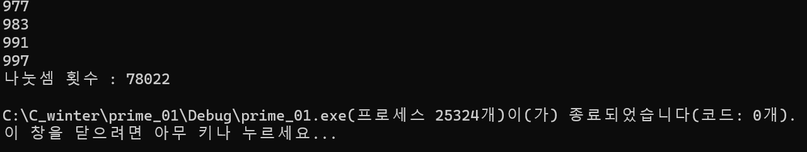

### 2024.02.12
# **Prime Algorithm - version_01**

## 1. code
 ```c
#include <stdio.h>

int main(void) {
	int counter = 0;
	for (int n = 2; n <= 1000; n++) {
		int i;
		for (i = 2; i < n; i++) {
			counter++;
			if (n % i == 0) {
				break;
			}
		}
		if (n == i) {
			printf("%d\n", n);
		}
	}
	printf("나눗셈 횟수 : %d\n", counter);

	return 0;
}
 ```
***

## 2. output

***

## 3. Analysis
### How to approach
Set integers n from 1 to 1000 and i from 1 to n.

If i divides n, it's not a prime number. 

Finally, if ( n == i ), n is a prime number.

### Pros and Cons
Simple but Complex

*It repeats unnecessary calcultaions.*
